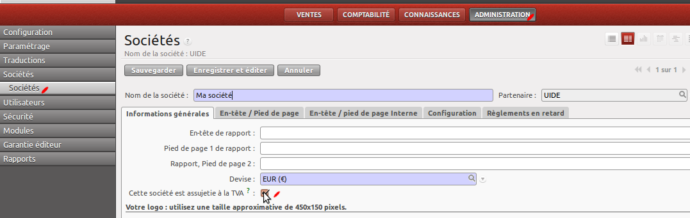

Configuration
=============

Avant de pouvoir utiliser le module, vous allez devoir le configurer :

    * Définir si votre société est assujetie à la TVA
    * Créer/Importer des modèles

Assujetissement à la TVA
------------------------

Il est possible que votre société ne soit pas assujetie à la TVA, c'est le cas des associations
par exemple. Si c'est votre cas, vous devez décocher l'option dans les paramètres de votre société :

Si vous désactivez cette option, le champ "Taxe" du modèle ne sera pas utilisé, bien qu'il soit affiché.

Création des modèles
--------------------

Vous devez ensuite créez vos modèles.
